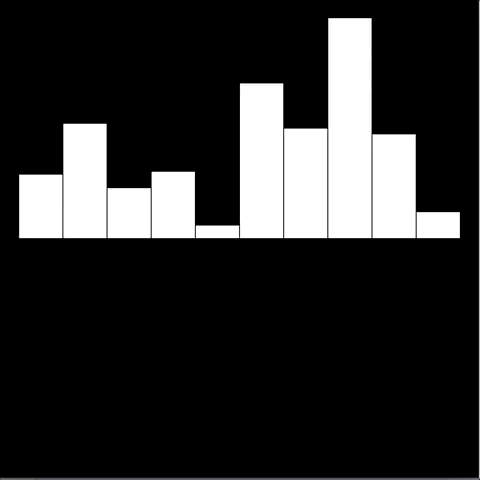

# Purpose

For this project we will use Processing which is an introductory programming language with similar syntax to Java. It is developed with the goal of easily learning to program by seeing visual productions on the screen. The language is very easy to pick up and begin creating with if you have prior knowledge of programming. For this project you must first choose a sorting algorithm. Once this is done, we will use Processing to visualize it using a method of your choice. This will involve first implementing the algorithm and making sure it is correct. Once the algorithm is implemented, it should be easy to augment it and represent the execution of each discrete step visually on the screen. If you would like to become acquainted with Processing, feel free to visit their website ([Link](https://processing.org/)). Here you will find a download for their IDE. You can also find many tutorials to get started experimenting with the language.

Everyone has heard the word algorithm – but what is it? The Merriam-Webster dictionary defines it as “a procedure for solving a mathematical problem in a finite number of steps that frequently involves repetition of an operation.” A more diluted version of this same statement could be a step-by-step procedure for solving a problem. An interesting aspect of algorithms is that they are a pre-defined order of discrete steps. This means there are completely separable actions that are done when executing the algorithm. This plays nicely into our project because we will be visualizing each one of these discrete steps of some algorithm as it executes in order to show how it works! Algorithms are applied throughout every facet of life. For this project we will focus on two particular algorithms: KNN (K nearest neighbors) and Insertion Sort. You will choose one of the proposed algorithms and visualize its execution.

Sorting Algorithms: A classic problem when programming is taking a set of inputs and sorting them according to some order. There is countless amounts of research into efficiently sorting data. Often times people take advantage of characteristics of data to make the sorting perform even faster. You may have seen [this](https://www.reddit.com/r/dataisbeautiful/comments/78fywy/sorting_algorithms_visualized_oc/) popular post on reddit visualizing some sorting algorithms (Link). Insertion sort is one of the easier to write sorting algorithms (You may notice as algorithms become faster, their complexity becomes higher). This could be a simple algorithm to visualize. [Here](https://www.geeksforgeeks.org/quiz-insertionsort-gq/) is a link to learn about Insertion Sort.

The other algorithm you could visualize is KNN (K nearest neighbor). This is an algorithm that is sometimes applied in machine learning systems in Computer Science. This algorithm deals with data sets. Its goal is to find the most similar data points within a data set given a query data point. The approach to doing this is fairly simple, but it is probably harder to visualize than a sorting algorithm. To read more about KNN, see [here](https://www.geeksforgeeks.org/k-nearest-neighbours/).

This should be an entertaining project that exposes you to sorting algorithms, a new programming language (Processing), and leaves you with a fun result.

# Approach

1. First, you must choose an algorithm. Once you choose an algorithm, make sure you understand how it works conceptually before writing any code.

2. Write up the algorithm. At this point, you should code up your chosen algorithm. At this step, you should have no visual elements, just write the algorithm and have it print out values to make sure its working!

3. Break down your algorithm into discrete steps. What are the discrete (independent) steps of your algorithm? It is important to do this because visualizing the algorithm requires animating each discrete step!

4. Iteratively implement each discrete step of your algorithm. Make sure each step works visually as you decompose your algorithm into individual steps.

5. Bring it all together. Once you're done with implementing each step, it should all work together!

Feel free to ask questions if you get stuck at any point along the way!

# Final Product

Your final products should look something like this:

## KNN

## Sorting

